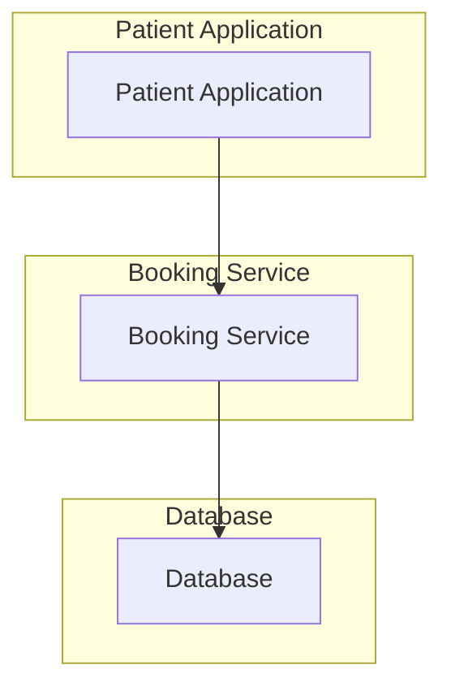

# Clinic Appointment Booking System Design

## 1. Introduction

This document outlines the system design for a clinic appointment booking system, tailored for a small clinic with five doctors. The primary goal is to enable patients to efficiently book, view, and cancel appointments online, while ensuring robust management of doctor schedules and appointment availability. This design focuses on scalability and reliability to support future growth.

## 2. System Overview

The system addresses the need for an online platform where patients can book 30-minute appointment slots with specific doctors. Each doctor has predefined working hours, and the system must prevent double-booking. The design prioritizes a clear separation of concerns, with a patient-facing application interacting with a backend booking service, which in turn manages data persistence.

## 3. Functional Requirements

The core functionalities of the system include:

*   **Patient Appointment Booking:** Patients can view available 30-minute slots for a chosen doctor on a specific day, select a slot, and book it. Booking confirmations will be provided.
*   **Appointment Cancellation:** Patients have the ability to cancel their previously booked appointments.
*   **Doctor Schedule Management:** The system will maintain and manage doctors' working hours and the availability of 30-minute appointment slots.
*   **Concurrency Control:** To prevent overbooking, once an appointment slot is booked, it must immediately become unavailable to other patients.

## 4. Non-Functional Requirements

Key non-functional aspects considered in this design are:

*   **Scalability:** The system is designed to be scalable, allowing for an increase in the number of doctors, patients, and potentially clinics without significant architectural changes.
*   **Reliability:** Appointment data must be accurate and consistent, with high availability to ensure continuous booking operations.
*   **Usability:** The patient-facing interface for booking and managing appointments should be intuitive and user-friendly.
*   **Security:** All patient and appointment data will be handled securely, adhering to privacy best practices.

## 5. Architecture Design

The system follows a layered architecture, comprising a patient application, a booking service, and a database. This separation allows for independent development, scaling, and maintenance of each component.

### High-Level Architecture



**Components:**

*   **Patient Application:** This is the client-side interface (e.g., a web application) that patients interact with to view schedules, book, and cancel appointments. It communicates with the Booking Service via API calls.
*   **Booking Service:** A backend service responsible for handling all business logic related to appointments, doctors, and patients. It exposes a RESTful API to the Patient Application and interacts with the Database for data persistence.
*   **Database:** Stores all system data, including doctor information, patient details, and appointment records.

## 6. Data Models

This section details the core data models.

### Doctor Model

Represents a doctor in the clinic.

| Field Name      | Data Type | Description                                   | Constraints        |
| :-------------- | :-------- | :-------------------------------------------- | :----------------- |
| `doctor_id`     | UUID      | Unique identifier for the doctor              | Primary Key, Unique|
| `name`          | String    | Full name of the doctor                       | Not Null           |
| `specialty`     | String    | Medical specialty of the doctor               | Optional           |
| `working_hours` | JSON      | Stores daily working hours (e.g., `{"Monday": {"start": "09:00", "end": "17:00"}}`) | Not Null           |

### Patient Model

Represents a patient using the booking system.

| Field Name    | Data Type | Description                                   | Constraints        |
| :------------ | :-------- | :-------------------------------------------- | :----------------- |
| `patient_id`  | UUID      | Unique identifier for the patient             | Primary Key, Unique|
| `name`        | String    | Full name of the patient                      | Not Null           |
| `email`       | String    | Email address of the patient                  | Unique, Not Null   |
| `phone_number`| String    | Phone number of the patient                   | Optional           |

### Appointment Model

Represents a booked appointment.

| Field Name        | Data Type | Description                                   | Constraints        |
| :---------------- | :-------- | :-------------------------------------------- | :----------------- |
| `appointment_id`  | UUID      | Unique identifier for the appointment         | Primary Key, Unique|
| `doctor_id`       | UUID      | Foreign key referencing the Doctor model      | Not Null           |
| `patient_id`      | UUID      | Foreign key referencing the Patient model     | Not Null           |
| `start_time`      | DateTime  | Start time of the appointment                 | Not Null           |
| `end_time`        | DateTime  | End time of the appointment (30 minutes after start_time) | Not Null           |
| `status`          | Enum      | Current status of the appointment (e.g., `booked`, `cancelled`, `completed`) | Not Null, Default: `booked` |
| `created_at`      | DateTime  | Timestamp when the appointment was created    | Not Null           |

### AvailabilitySlot Model

Represents a potential 30-minute slot for a doctor. This model is primarily conceptual for API representation; actual availability is derived from `Doctor.working_hours` and existing `Appointment` records.

| Field Name    | Data Type | Description                                   | Constraints        |
| :------------ | :-------- | :-------------------------------------------- | :----------------- |
| `slot_id`     | UUID      | Unique identifier for the availability slot   | Primary Key, Unique|
| `doctor_id`   | UUID      | Foreign key referencing the Doctor model      | Not Null           |
| `start_time`  | DateTime  | Start time of the 30-minute slot              | Not Null           |
| `end_time`    | DateTime  | End time of the 30-minute slot                | Not Null           |
| `is_booked`   | Boolean   | Indicates if the slot is currently booked     | Not Null, Default: `false` |

## 7. API Design

The Booking Service exposes a RESTful API with the following endpoints:

### Base URL

`/api/v1`

### Endpoints

#### 7.1. Get Doctor Availability

*   **Endpoint:** `GET /doctors/{doctor_id}/availability`
*   **Description:** Retrieves available 30-minute slots for a specific doctor on a given day.
*   **Query Parameters:**
    *   `date`: (Required) Date in `YYYY-MM-DD` format.
*   **Response (200 OK):** A JSON array of available slots.

#### 7.2. Book Appointment

*   **Endpoint:** `POST /appointments`
*   **Description:** Allows a patient to book an available slot.
*   **Request Body:** Contains `doctor_id`, `patient_id`, and `start_time`.
*   **Response (201 Created):** Details of the newly created appointment.
*   **Error Response (409 Conflict):** If the slot is already booked.

#### 7.3. Cancel Appointment

*   **Endpoint:** `PUT /appointments/{appointment_id}/cancel`
*   **Description:** Allows a patient to cancel a booked appointment.
*   **Response (200 OK):** Details of the cancelled appointment.
*   **Error Response (404 Not Found):** If the appointment does not exist.
*   **Error Response (400 Bad Request):** If the appointment cannot be cancelled (e.g., due to policy).

#### 7.4. Get Patient Appointments

*   **Endpoint:** `GET /patients/{patient_id}/appointments`
*   **Description:** Retrieves all appointments for a specific patient.
*   **Response (200 OK):** A JSON array of the patient's appointments.

## 8. Key Decisions and Trade-offs

### 8.1. Availability Slot Management

*   **Decision:** Initially, `AvailabilitySlot` data will be generated dynamically by the Booking Service based on `Doctor.working_hours` and existing `Appointment` records. This avoids the need for a separate `AvailabilitySlot` table in the database for the initial phase.
*   **Trade-off:** While simplifying the database schema and reducing storage, this approach might introduce performance overhead for highly concurrent requests or when querying availability for many doctors over extended periods. If performance becomes a bottleneck, pre-generating and storing `AvailabilitySlot` records in the database would be a viable optimization, trading increased storage and complexity for improved read performance.

### 8.2. Technology Stack (Implicit)

*   **Decision:** The design is agnostic to a specific technology stack, allowing flexibility in implementation (Django, PostgreSQLfor the Database).
*   **Trade-off:** While providing flexibility, this requires careful consideration during implementation to select technologies that align with the team's expertise and project requirements for scalability and maintainability.

### 8.3. Concurrency Control

*   **Decision:** Concurrency for booking slots will be handled at the Booking Service level, likely using database transactions or optimistic locking mechanisms to ensure that a slot, once booked, cannot be simultaneously booked by another patient.
*   **Trade-off:** Implementing robust concurrency control adds complexity to the service logic and database interactions. Incorrect implementation can lead to race conditions or deadlocks, impacting system reliability.

## SECTION THREE

### Public Url

[Clinic Booking](https://clinic-booking-t646.onrender.com)

### Deployment trigger

The pipeline deploys automatically when a pull request is merged into the main branch. Any push directly to main (which is what a merge produces) triggers the deploy job in the GitHub Actions workflow. Pull requests opened against main only run the test suite — they never trigger a deployment on their own, only after being merged.

### Pipeline description

The CI/CD pipeline is defined in .github/workflows/action.yml and runs on GitHub Actions. It has two jobs:

**Test** — runs on every pull request targeting main and on every push to main. It spins up a disposable PostgreSQL 16 service container, installs dependencies from requirements.txt, checks for missing Django migrations (makemigrations --check --dry-run), applies migrations, and runs the full Django test suite (manage.py test). This acts as a quality gate — code with failing tests or unmigrated model changes cannot proceed to deployment.

**Deploy** — runs only on a push to main, and only if the test job passes (needs: test). It sends a POST request to Render's deploy hook URL (stored as a GitHub secret, RENDER_DEPLOY_HOOK_URL), which triggers Render to pull the latest main branch, rebuild the app, and redeploy it.

## SECTION FOUR

### 1. What did you use AI for across the four sections?

**.** Writing the test files

**.** Generating the models

### 2. Give one example where an AI suggestion improved your work. What did you prompt it with?

when deploying the app on render it help me catch a typo I write `gunicorn clinic_booking.wsgi.application` instead of `gunicorn clinic_booking.wsgi:application` and missing of gunicorn in requirement.txt. I used claude code.

### 3. Give one example where AI output was wrong or incomplete and how you caught it

when the AI was writing the test files it add put in place of patch on the endpoint (appointments/<uuid:appointment_id>/cancel/").
I caught by running the test suite.

### Name two decisions you made without AI. Why did you trust your own judgment there?

**.**  Appointment duration and booking-buffer rules (30-minute slots, 1-hour minimum advance booking) - because these are product/domain decisions specific to how a clinic actually operates, not technical implementation details.

**.** Database connection - because of the database credentials you cannot give any AI secret credentials to use.

## RUNNING THE PROJECT LOCALLY

1. Ensure you have VS Code, Python 3.12+, and Git installed on your computer.

2. Clone the repository:

```bash
   git clone https://github.com/kaguthi/clinic_booking.git
   cd clinic_booking
```

3.Create and activate a virtual environment:

```bash
   python -m venv venv
   source venv/bin/activate   # macOS/Linux
   venv\Scripts\activate      # Windows
```

4.Install dependencies:

```bash
   pip install -r requirements.txt
```

5.Create a `.env` file in the repo root with the following variables:

```
    SECRET_KEY=your-secret-key-here
    DEBUG=True
    PGDATABASE=your-db-name
    PGUSER=your-db-user
    PGPASSWORD=your-db-password
    PGHOST=your-db-host
    PGPORT=5432
    PGSSLMODE=require
```

6. Set up a PostgreSQL database. You can use a free instance from [Neon](https://neon.com/), or any other PostgreSQL provider:
   - Create an account and a new project on Neon
   - Copy the connection details (host, database name, user, password) into your `.env` file from step 5

7. Navigate to the Django project directory and run migrations:
```bash
   cd clinic_booking
   python manage.py migrate
```

8. Create a superuser (optional, for Django admin access):
```bash
   python manage.py createsuperuser
```

9. Run the development server:
```bash
   python manage.py runserver
```

10. The API will be available at `http://127.0.0.1:8000/api/v1/`, and the DRF browsable API can be explored directly in your browser at that address.

11. To run the test suite:
```bash
    python manage.py test
```